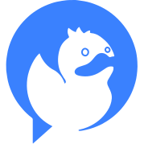

  
  
   
  
  
<strong>DeckDeckGo</strong> - The open source web editor for presentations

  
  
Create slides with our <a href="https://deckdeckgo.com">online editor</a> or developer kit 🔥.

  
  
Interact with your decks through a <a href="https://deckdeckgo.app">remote control</a> 📱.

  
   
  
  
  
  
  
  

---

## Table of contents

- [Getting Started](#getting-started)
- [Features](#features)
- [Documentation](#documentation)
- [Contributing](#contributing)
- [Community](#community)
- [Progressive Web Apps](#progressive-web-apps)
- [Web Components](#web-components)
- [Others](#others)

## Getting Started

Start your new presentation using our 👉 [online Editor](https://deckdeckgo.com) 👈 or with our developer kit by following the quick [Getting Started guide](https://docs.deckdeckgo.com/docs).

## Features

We are constantly developing new features and, are always happy to hear about cool ideas.

- Create, present and share your slides as Progressive Web Apps
- Interact with your audience with live polls
- Use predefined rich and responsive templates
- Search Unsplash and Tenor GIFs
- Integrate easily Youtube video
- Showcase your best developer code snippets
- Interact with your presentations with a remote control
- Present and work offline
- Push the source code of your online slides to GitHub

## Documentation

The developers' documentation is available [online](https://docs.deckdeckgo.com).

## Contributing

Are you interested to contribute to our open source project? That would be awesome 👍 Have a look to our contributing [guide](CONTRIBUTING.md) to get started.

## Community

Templates and tools that are driven by the community of DeckDeckGo developers and maintainers are gathered together in a dedicated GitHub [org](https://github.com/deckgo-community).

If you would like to add your contribution, get in [touch](https://deckdeckgo.com/en/contact).

## Progressive Web Apps

| Project            | Version                                                                                                                       | Online                                                     |                   Links                   |                               Changelog                                |
| ------------------ | ----------------------------------------------------------------------------------------------------------------------------- | ---------------------------------------------------------- | :---------------------------------------: | :--------------------------------------------------------------------: |
| **Studio**         |   | [https://app.deckdeckgo.com](https://app.deckdeckgo.com)   |       [`README`](studio/README.md)        |                   [`CHANGELOG`](studio/CHANGELOG.md)                   |
| **Remote control** |      | [https://deckdeckgo.app](https://deckdeckgo.app)           |       [`README`](remote/README.md)        |                   [`CHANGELOG`](remote/CHANGELOG.md)                   |
| **Documentation**  |  | [https://docs.deckdeckgo.com](https://docs.deckdeckgo.com) |        [`README`](docs/README.md)         |                    [`CHANGELOG`](docs/CHANGELOG.md)                    |
| **Site**           |       | [https://deckdeckgo.com](https://deckdeckgo.com)           |        [`README`](site/README.md)         |                    [`CHANGELOG`](site/CHANGELOG.md)                    |
| **Demo**           |  | [https://demo.deckdeckgo.com](https://demo.deckdeckgo.com) | [`Repo`](https://github.com/deckgo/demo/) | [`CHANGELOG`](https://github.com/deckgo/demo/blob/master/CHANGELOG.md) |

## Web Components

| Project                     | Package                                                                                          | Version                                                                                                                                                          |                         Links                          |                          Changelog                           |
| --------------------------- | ------------------------------------------------------------------------------------------------ | ---------------------------------------------------------------------------------------------------------------------------------------------------------------- | :----------------------------------------------------: | :----------------------------------------------------------: |
| **Core**                    | [`@deckdeckgo/core`](https://www.npmjs.com/package/@deckdeckgo/core)                             |                              |        [`README`](webcomponents/core/README.md)        |        [`CHANGELOG`](webcomponents/core/CHANGELOG.md)        |
| **Charts**                  | [`@deckdeckgo/charts`](https://www.npmjs.com/package/@deckdeckgo/charts)                         |                          |       [`README`](webcomponents/charts/README.md)       |       [`CHANGELOG`](webcomponents/charts/CHANGELOG.md)       |
| **Color**                   | [`@deckdeckgo/color`](https://www.npmjs.com/package/@deckdeckgo/color)                           |                            |       [`README`](webcomponents/color/README.md)        |       [`CHANGELOG`](webcomponents/color/CHANGELOG.md)        |
| **Demo**                    | [`@deckdeckgo/demo`](https://www.npmjs.com/package/@deckdeckgo/demo)                             |                              |        [`README`](webcomponents/demo/README.md)        |        [`CHANGELOG`](webcomponents/demo/CHANGELOG.md)        |
| **Drag, Resize and Rotate** | [`@deckdeckgo/drag-resize-rotate`](https://www.npmjs.com/package/@deckdeckgo/drag-resize-rotate) |  | [`README`](webcomponents/drag-resize-rotate/README.md) | [`CHANGELOG`](webcomponents/drag-resize-rotate/CHANGELOG.md) |
| **Highlight code**          | [`@deckdeckgo/highlight-code`](https://www.npmjs.com/package/@deckdeckgo/highlight-code)         |          |   [`README`](webcomponents/highlight-code/README.md)   |   [`CHANGELOG`](webcomponents/highlight-code/CHANGELOG.md)   |
| **Inline editor**           | [`@deckdeckgo/inline-editor`](https://www.npmjs.com/package/@deckdeckgo/inline-editor)           |            |   [`README`](webcomponents/inline-editor/README.md)    |   [`CHANGELOG`](webcomponents/inline-editor/CHANGELOG.md)    |
| **Lazy image**              | [`@deckdeckgo/lazy-img`](https://www.npmjs.com/package/@deckdeckgo/lazy-img)                     |                      |      [`README`](webcomponents/lazy-img/README.md)      |      [`CHANGELOG`](webcomponents/lazy-img/CHANGELOG.md)      |
| **Math**                    | [`@deckdeckgo/math`](https://www.npmjs.com/package/@deckdeckgo/math)                             |                              |        [`README`](webcomponents/math/README.md)        |        [`CHANGELOG`](webcomponents/math/CHANGELOG.md)        |
| **Markdown**                | [`@deckdeckgo/markdown`](https://www.npmjs.com/package/@deckdeckgo/markdown)                     |                      |      [`README`](webcomponents/markdown/README.md)      |      [`CHANGELOG`](webcomponents/markdown/CHANGELOG.md)      |
| **Pager**                   | [`@deckdeckgo/pager`](https://www.npmjs.com/package/@deckdeckgo/pager)                           |                            |       [`README`](webcomponents/pager/README.md)        |       [`CHANGELOG`](webcomponents/pager/CHANGELOG.md)        |
| **QR-Code**                 | [`@deckdeckgo/qrcode`](https://www.npmjs.com/package/@deckdeckgo/qrcode)                         |                          |       [`README`](webcomponents/qrcode/README.md)       |       [`CHANGELOG`](webcomponents/qrcode/CHANGELOG.md)       |
| **Remote**                  | [`@deckdeckgo/remote`](https://www.npmjs.com/package/@deckdeckgo/remote)                         |                          |       [`README`](webcomponents/remote/README.md)       |       [`CHANGELOG`](webcomponents/remote/CHANGELOG.md)       |
| **Reveal**                  | [`@deckdeckgo/reveal`](https://www.npmjs.com/package/@deckdeckgo/reveal)                         |                          |       [`README`](webcomponents/reveal/README.md)       |       [`CHANGELOG`](webcomponents/reveal/CHANGELOG.md)       |
| **Social**                  | [`@deckdeckgo/social`](https://www.npmjs.com/package/@deckdeckgo/social)                         |                          |       [`README`](webcomponents/social/README.md)       |       [`CHANGELOG`](webcomponents/social/CHANGELOG.md)       |
| **Word cloud**              | [`@deckdeckgo/word-cloud`](https://www.npmjs.com/package/@deckdeckgo/word-cloud)                 |                  |     [`README`](webcomponents/word-cloud/README.md)     |     [`CHANGELOG`](webcomponents/word-cloud/CHANGELOG.md)     |
| **YouTube**                 | [`@deckdeckgo/youtube`](https://www.npmjs.com/package/@deckdeckgo/youtube)                       |                        |      [`README`](webcomponents/youtube/README.md)       |      [`CHANGELOG`](webcomponents/youtube/CHANGELOG.md)       |

## Web Components - Slides/Templates

| Project          | Package                                                                                          | Version                                                                                                                                                          |                          Links                          |                           Changelog                           |
| ---------------- | ------------------------------------------------------------------------------------------------ | ---------------------------------------------------------------------------------------------------------------------------------------------------------------- | :-----------------------------------------------------: | :-----------------------------------------------------------: |
| **Author**       | [`@deckdeckgo/slide-author`](https://www.npmjs.com/package/@deckdeckgo/slide-author)             |              |    [`README`](webcomponents/slides/author/README.md)    |    [`CHANGELOG`](webcomponents/slides/author/CHANGELOG.md)    |
| **Aspect Ratio** | [`@deckdeckgo/slide-aspect-ratio`](https://www.npmjs.com/package/@deckdeckgo/slide-aspect-ratio) |  | [`README`](webcomponents/slides/aspect-ratio/README.md) | [`CHANGELOG`](webcomponents/slides/aspect-ratio/CHANGELOG.md) |
| **Chart**        | [`@deckdeckgo/slide-chart`](https://www.npmjs.com/package/@deckdeckgo/slide-chart)               |                |    [`README`](webcomponents/slides/chart/README.md)     |    [`CHANGELOG`](webcomponents/slides/chart/CHANGELOG.md)     |
| **Code**         | [`@deckdeckgo/slide-code`](https://www.npmjs.com/package/@deckdeckgo/slide-code)                 |                  |     [`README`](webcomponents/slides/code/README.md)     |     [`CHANGELOG`](webcomponents/slides/code/CHANGELOG.md)     |
| **Content**      | [`@deckdeckgo/slide-content`](https://www.npmjs.com/package/@deckdeckgo/slide-content)           |            |   [`README`](webcomponents/slides/content/README.md)    |   [`CHANGELOG`](webcomponents/slides/content/CHANGELOG.md)    |
| **Gif**          | [`@deckdeckgo/slide-gif`](https://www.npmjs.com/package/@deckdeckgo/slide-gif)                   |                    |     [`README`](webcomponents/slides/gif/README.md)      |     [`CHANGELOG`](webcomponents/slides/gif/CHANGELOG.md)      |
| **Playground**   | [`@deckdeckgo/slide-playground`](https://www.npmjs.com/package/@deckdeckgo/slide-playground)     |      |  [`README`](webcomponents/slides/playground/README.md)  |  [`CHANGELOG`](webcomponents/slides/playground/CHANGELOG.md)  |
| **Poll**         | [`@deckdeckgo/slide-poll`](https://www.npmjs.com/package/@deckdeckgo/slide-poll)                 |                  |     [`README`](webcomponents/slides/poll/README.md)     |     [`CHANGELOG`](webcomponents/slides/poll/CHANGELOG.md)     |
| **QR Code**      | [`@deckdeckgo/slide-qrcode`](https://www.npmjs.com/package/@deckdeckgo/slide-qrcode)             |              |    [`README`](webcomponents/slides/qrcode/README.md)    |    [`CHANGELOG`](webcomponents/slides/qrcode/CHANGELOG.md)    |
| **Split**        | [`@deckdeckgo/slide-split`](https://www.npmjs.com/package/@deckdeckgo/slide-split)               |                |    [`README`](webcomponents/slides/split/README.md)     |    [`CHANGELOG`](webcomponents/slides/split/CHANGELOG.md)     |
| **Title**        | [`@deckdeckgo/slide-title`](https://www.npmjs.com/package/@deckdeckgo/slide-title)               |                |    [`README`](webcomponents/slides/title/README.md)     |    [`CHANGELOG`](webcomponents/slides/title/CHANGELOG.md)     |
| **YouTube**      | [`@deckdeckgo/slide-youtube`](https://www.npmjs.com/package/@deckdeckgo/slide-youtube)           |            |   [`README`](webcomponents/slides/youtube/README.md)    |   [`CHANGELOG`](webcomponents/slides/youtube/CHANGELOG.md)    |

## Utils for the Web Components

| Project          | Package                                                                              | Version                                                                                                                                              |               Links                |                Changelog                 |
| ---------------- | ------------------------------------------------------------------------------------ | ---------------------------------------------------------------------------------------------------------------------------------------------------- | :--------------------------------: | :--------------------------------------: |
| **Deck Utils**   | [`@deckdeckgo/deck-utils`](https://www.npmjs.com/package/@deckdeckgo/deck-utils)     |      |  [`README`](utils/deck/README.md)  |  [`CHANGELOG`](utils/deck/CHANGELOG.md)  |
| **Kit**          | [`@deckdeckgo/kit`](https://www.npmjs.com/package/@deckdeckgo/kit)                   |                    |  [`README`](utils/kit/README.md)   |  [`CHANGELOG`](utils/kit/CHANGELOG.md)   |
| **Remote Utils** | [`@deckdeckgo/remote-utils`](https://www.npmjs.com/package/@deckdeckgo/remote-utils) |  | [`README`](utils/remote/README.md) | [`CHANGELOG`](utils/remote/CHANGELOG.md) |
| **Slide Utils**  | [`@deckdeckgo/slide-utils`](https://www.npmjs.com/package/@deckdeckgo/slide-utils)   |    | [`README`](utils/slide/README.md)  | [`CHANGELOG`](utils/slide/CHANGELOG.md)  |
| **Types**        | [`@deckdeckgo/types`](https://www.npmjs.com/package/@deckdeckgo/types)               |                | [`README`](utils/types/README.md)  | [`CHANGELOG`](utils/types/CHANGELOG.md)  |
| **Utils**        | [`@deckdeckgo/utils`](https://www.npmjs.com/package/@deckdeckgo/utils)               |                | [`README`](utils/utils/README.md)  | [`CHANGELOG`](utils/utils/CHANGELOG.md)  |

## Others

| Project                          | Package                                                                                  | Version                                                                                                                                                      |                               Links                               |                                           Changelog                                            |
| -------------------------------- | ---------------------------------------------------------------------------------------- | ------------------------------------------------------------------------------------------------------------------------------------------------------------ | :---------------------------------------------------------------: | :--------------------------------------------------------------------------------------------: |
| **Backend**                      |                                                                                          |                                                                   |                   [`README`](backend/README.md)                   |                              [`CHANGELOG`](backend/CHANGELOG.md)                               |
| **CLI**                          | [`create-deckdeckgo`](https://www.npmjs.com/package/create-deckdeckgo)                   |                        |                     [`README`](cli/README.md)                     |                                [`CHANGELOG`](cli/CHANGELOG.md)                                 |
| **Cloud**                        |                                                                                          |                                                                |                    [`README`](cloud/README.md)                    |                               [`CHANGELOG`](cloud/CHANGELOG.md)                                |
| **Gatsby plugin highlight code** |                                                                                          |  | [`Repo`](https://github.com/deckgo/gatsby-remark-highlight-code/) | [`CHANGELOG`](https://github.com/deckgo/gatsby-remark-highlight-code/blob/master/CHANGELOG.md) |
| **Infrastructure**               |                                                                                          |                                                                                                                                                              |                    [`README`](infra/README.md)                    |                                                                                                |
| **Starter kit**                  |                                                                                          |                                                                   |          [`Repo`](http://github.com/deckgo/starter-kit/)          |         [`CHANGELOG`](https://github.com/deckgo/starter-kit/blob/master/CHANGELOG.md)          |
| **Studio kit**                   |                                                                                          |                                                                   |          [`Repo`](http://github.com/deckgo/studio-kit/)           |          [`CHANGELOG`](https://github.com/deckgo/studio-kit/blob/master/CHANGELOG.md)          |
| **Template kit**                 |                                                                                          |                                                                   |         [`Repo`](http://github.com/deckgo/template-kit/)          |         [`CHANGELOG`](https://github.com/deckgo/template-kit/blob/master/CHANGELOG.md)         |
| **WAI Lambda**                   |                                                                                          |                                                                                                                                                              |          [`Repo`](https://github.com/deckgo/wai-lambda)           |                                                                                                |
| **Webpack plugins**              | [`deckdeckgo-webpack-plugins`](https://www.npmjs.com/package/deckdeckgo-webpack-plugins) |      |                   [`README`](webpack/README.md)                   |                              [`CHANGELOG`](webpack/CHANGELOG.md)                               |

[deckdeckgo]: https://deckdeckgo.com
