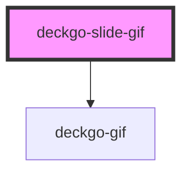

# deckgo-slide-gif

The "GIF" slide let you add easily a GIF, like those provided by [Giphy](https://giphy.com), to your presentation.

## Video

Have a look at this video where we demonstrate how to use it!

<iframe width="560" height="315" src="https://www.youtube.com/embed/0X3k3-yP7-Q" frameborder="0"></iframe>

## Installation

This template could be added to your presentation using the following methods.

> This template is included per default in our Developer Kit

### From a CDN

It's recommended to use [unpkg](https://unpkg.com/) if you want to use this template from a CDN. To do so, add the following include script in the main HTML file of your project:

```
<script type="module" src="https://unpkg.com/@deckdeckgo/slide-gif@latest/dist/deckdeckgo-slide-gif/deckdeckgo-slide-gif.esm.js"></script>
```

### From NPM

To install this template in your project from [npm](https://www.npmjs.com/package/@deckdeckgo/slide-gif) run the following command:

```bash
npm install @deckdeckgo/slide-gif
```

### Framework integration

The [Stencil documentation](https://stenciljs.com/docs/overview) provide examples of framework integration for [Angular](https://stenciljs.com/docs/angular), [React](https://stenciljs.com/docs/react), [Vue](https://stenciljs.com/docs/vue) and [Ember](https://stenciljs.com/docs/ember).

That being said, commonly, you might either `import` or `load` it:

#### Import

```
import '@deckdeckgo/slide-gif';
```

#### Loader

```
import { defineCustomElements as deckDeckGoSlideElement } from '@deckdeckgo/slide-gif/dist/loader';
deckDeckGoSlideElement();
```

## For images too

The slide GIF is useful for GIFs but could be use for any images too, in case you would like for example to display an image fullscreen.

## Usage

The "GIF" slide's Web Component could be integrated using the tag `<deckgo-slide-gif/>`.

```
<deckgo-slide-gif src="https://media.giphy.com/media/xUA7baWfTjfHGLZc3e/giphy.gif" alt="My gif" fullscreen="true">
  <h1 slot="title">My title</h1>
  <h1 slot="header">Hey</h1>
  <h2 slot="footer">It's a cool gif</h2>
</deckgo-slide-gif>
```

<!-- Auto Generated Below -->


## Properties

| Property           | Attribute           | Description                                                                                                             | Type      | Default     |
| ------------------ | ------------------- | ----------------------------------------------------------------------------------------------------------------------- | --------- | ----------- |
| `alt`              | `alt`               | An alternate text for the Gif                                                                                           | `string`  | `undefined` |
| `customActions`    | `custom-actions`    | If you provide actions for the all deck but, a specific one for this slide, set this option to true                     | `boolean` | `false`     |
| `customBackground` | `custom-background` | If you define a background for the all deck but, a specific one for this slide, set this option to true                 | `boolean` | `false`     |
| `fullscreen`       | `fullscreen`        | If set to true, the GIF width and height will be related to the slide width and height respectively will be fullscreen. | `boolean` | `true`      |
| `src`              | `src`               | The src (url) of the Gif                                                                                                | `string`  | `undefined` |


## Events

| Event          | Description                        | Type                |
| -------------- | ---------------------------------- | ------------------- |
| `slideDidLoad` | Triggered when the slide is loaded | `CustomEvent<void>` |


## Methods

### `afterSwipe() => Promise<void>`


#### Returns

Type: `Promise<void>`


### `beforeSwipe(_enter: boolean, _reveal: boolean) => Promise<boolean>`


#### Returns

Type: `Promise<boolean>`


### `hideContent() => Promise<void>`


#### Returns

Type: `Promise<void>`


### `lazyLoadContent() => Promise<void>`


#### Returns

Type: `Promise<void>`


### `revealContent() => Promise<void>`


#### Returns

Type: `Promise<void>`


## Slots

| Slot           | Description                                    |
| -------------- | ---------------------------------------------- |
| `"actions"`    | Custom actions for this slide                  |
| `"background"` | A custom background for this slide             |
| `"bottom"`     | An element to display at the bottom of the Gif |
| `"footer"`     | A custom footer for this slide                 |
| `"header"`     | A custom header for this slide                 |
| `"notes"`      | Some notes related to this slide               |
| `"title"`      | A title                                        |
| `"top"`        | An element to display at the top of the Gif    |


## CSS Custom Properties

| Name                     | Description                                                        |
| ------------------------ | ------------------------------------------------------------------ |
| `--background`           | background                                                         |
| `--color`                | color                                                              |
| `--margin`               | container margin @default 16px 0 and 32px 0 on wide screen         |
| `--overflow`             | overflow of the slide @default hidden                              |
| `--padding`              | container padding @default 8px                                     |
| `--slide-padding-bottom` | Padding bottom of the slide @default 64px and 32px on wider screen |
| `--slide-padding-end`    | Padding right of the slide @default 64px and 32px on wider screen  |
| `--slide-padding-start`  | Padding left of the slide @default 64px and 32px on wider screen   |
| `--slide-padding-top`    | Padding top of the slide @default 64px and 32px on wider screen    |
| `--slide-user-select`    | user select @default none                                          |
| `--zIndex`               | z-index @default 1                                                 |


## Dependencies

### Depends on

- [deckgo-gif](../gif)

### Graph


----------------------------------------------

*Built with [StencilJS](https://stenciljs.com/)*
