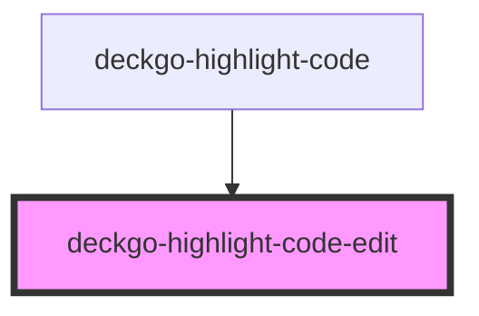

# deckgo-highlight-code-edit

<!-- Auto Generated Below -->

## Properties

| Property | Attribute | Description | Type     | Default     |
| -------- | --------- | ----------- | -------- | ----------- |
| `label`  | `label`   |             | `string` | `undefined` |

## Events

| Event      | Description | Type                |
| ---------- | ----------- | ------------------- |
| `editCode` |             | `CustomEvent<void>` |

## Shadow Parts

| Part                                                                         | Description |
| ---------------------------------------------------------------------------- | ----------- |
| `"edit-button"`                                                              |             |
| `"edit-button: A CSS :part to access the button"`                            |             |
| `"edit-icon"`                                                                |             |
| `"edit-icon: A CSS :part to access the SVG icon rendered within the button"` |             |

## Dependencies

### Used by

 - [deckgo-highlight-code](../highlight-code)

### Graph

----------------------------------------------

*Built with [StencilJS](https://stenciljs.com/)*
