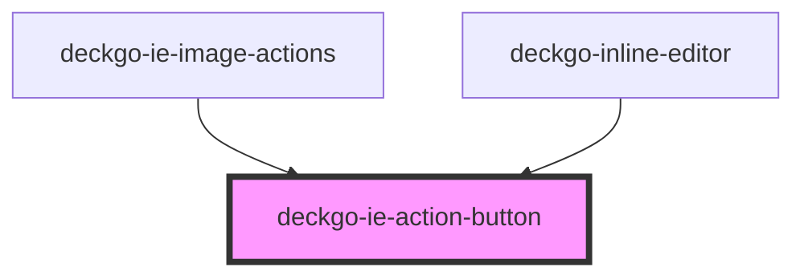

# deckgo-ie-action-button

<!-- Auto Generated Below -->

## Properties

| Property        | Attribute        | Description | Type      | Default     |
| --------------- | ---------------- | ----------- | --------- | ----------- |
| `cssClass`      | `css-class`      |             | `string`  | `undefined` |
| `disableAction` | `disable-action` |             | `boolean` | `false`     |
| `mobile`        | `mobile`         |             | `boolean` | `undefined` |

## Events

| Event    | Description | Type                   |
| -------- | ----------- | ---------------------- |
| `action` |             | `CustomEvent<UIEvent>` |

## Dependencies

### Used by

- [deckgo-ie-image-actions](../image-actions)
- [deckgo-inline-editor](../inline-editor)

### Graph

---

_Built with [StencilJS](https://stenciljs.com/)_
