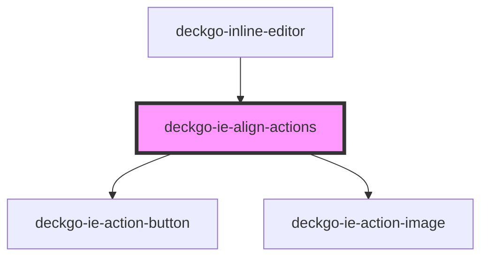

# deckgo-ie-align-actions

<!-- Auto Generated Below -->

## Properties

| Property       | Attribute       | Description | Type                                                             | Default     |
| -------------- | --------------- | ----------- | ---------------------------------------------------------------- | ----------- |
| `contentAlign` | `content-align` |             | `ContentAlign.CENTER \| ContentAlign.LEFT \| ContentAlign.RIGHT` | `undefined` |
| `mobile`       | `mobile`        |             | `boolean`                                                        | `undefined` |
| `selection`    | --              |             | `Selection`                                                      | `undefined` |

## Events

| Event       | Description | Type               |
| ----------- | ----------- | ------------------ |
| `initStyle` |             | `CustomEvent<any>` |

## Dependencies

### Used by

- [deckgo-inline-editor](../../inline-editor)

### Depends on

- [deckgo-ie-action-button](../../components/action-button)
- [deckgo-ie-action-image](../../components/action-image)

### Graph

---

_Built with [StencilJS](https://stenciljs.com/)_
