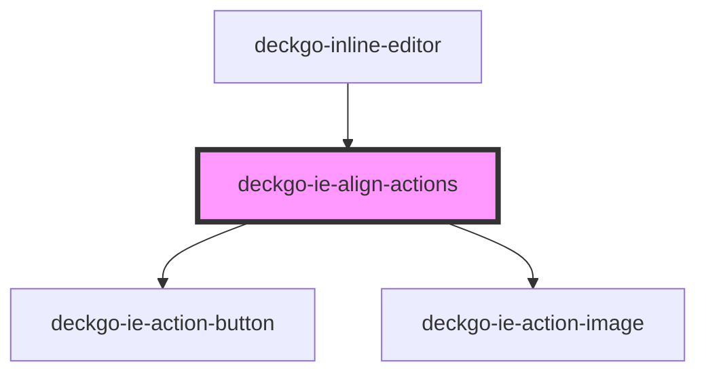

# deckgo-ie-align-actions

<!-- Auto Generated Below -->

## Properties

| Property       | Attribute       | Description | Type                                                             | Default     |
| -------------- | --------------- | ----------- | ---------------------------------------------------------------- | ----------- |
| `anchorEvent`  | --              |             | `MouseEvent \| TouchEvent`                                       | `undefined` |
| `command`      | `command`       |             | `"custom" \| "native"`                                           | `'native'`  |
| `containers`   | `containers`    |             | `string`                                                         | `undefined` |
| `contentAlign` | `content-align` |             | `ContentAlign.CENTER \| ContentAlign.LEFT \| ContentAlign.RIGHT` | `undefined` |
| `mobile`       | `mobile`        |             | `boolean`                                                        | `undefined` |
| `sticky`       | `sticky`        |             | `boolean`                                                        | `undefined` |

## Events

| Event           | Description | Type               |
| --------------- | ----------- | ------------------ |
| `alignModified` |             | `CustomEvent<any>` |

## Dependencies

### Used by

 - [deckgo-inline-editor](../../inline-editor)

### Depends on

- [deckgo-ie-action-button](../../components/action-button)
- [deckgo-ie-action-image](../../components/action-image)

### Graph

----------------------------------------------

*Built with [StencilJS](https://stenciljs.com/)*
