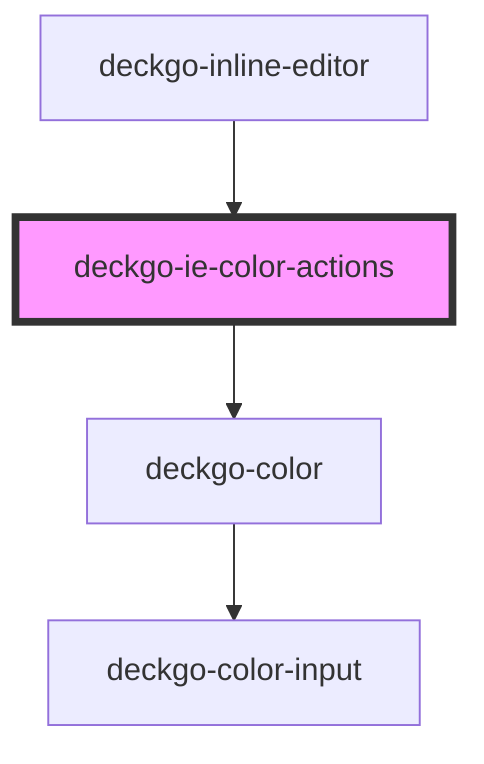

# deckgo-ie-color-actions

<!-- Auto Generated Below -->

## Properties

| Property     | Attribute    | Description | Type                            | Default     |
| ------------ | ------------ | ----------- | ------------------------------- | ----------- |
| `action`     | `action`     |             | `"background-color" \| "color"` | `undefined` |
| `containers` | `containers` |             | `string`                        | `undefined` |
| `mobile`     | `mobile`     |             | `boolean`                       | `undefined` |
| `palette`    | --           |             | `DeckdeckgoPalette[]`           | `undefined` |
| `selection`  | --           |             | `Selection`                     | `undefined` |

## Events

| Event         | Description | Type                             |
| ------------- | ----------- | -------------------------------- |
| `execCommand` |             | `CustomEvent<ExecCommandAction>` |

## Dependencies

### Used by

- [deckgo-inline-editor](../../inline-editor)

### Depends on

- deckgo-color

### Graph

---

_Built with [StencilJS](https://stenciljs.com/)_
