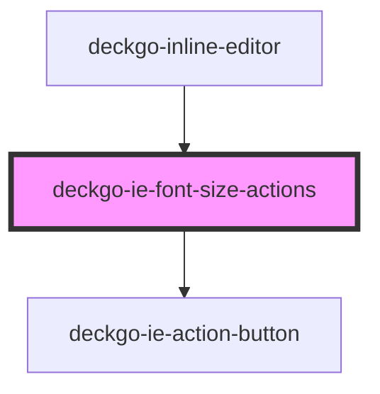

# deckgo-ie-font-size-actions

<!-- Auto Generated Below -->

## Properties

| Property   | Attribute   | Description | Type                                                                                                                                     | Default     |
| ---------- | ----------- | ----------- | ---------------------------------------------------------------------------------------------------------------------------------------- | ----------- |
| `fontSize` | `font-size` |             | `FontSize.LARGE \| FontSize.MEDIUM \| FontSize.SMALL \| FontSize.XXX_LARGE \| FontSize.XX_LARGE \| FontSize.X_LARGE \| FontSize.X_SMALL` | `undefined` |
| `mobile`   | `mobile`    |             | `boolean`                                                                                                                                | `undefined` |
| `sticky`   | `sticky`    |             | `boolean`                                                                                                                                | `undefined` |

## Events

| Event         | Description | Type                             |
| ------------- | ----------- | -------------------------------- |
| `execCommand` |             | `CustomEvent<ExecCommandAction>` |

## Dependencies

### Used by

 - [deckgo-inline-editor](../../inline-editor)

### Depends on

- [deckgo-ie-action-button](../../components/action-button)

### Graph

----------------------------------------------

*Built with [StencilJS](https://stenciljs.com/)*
