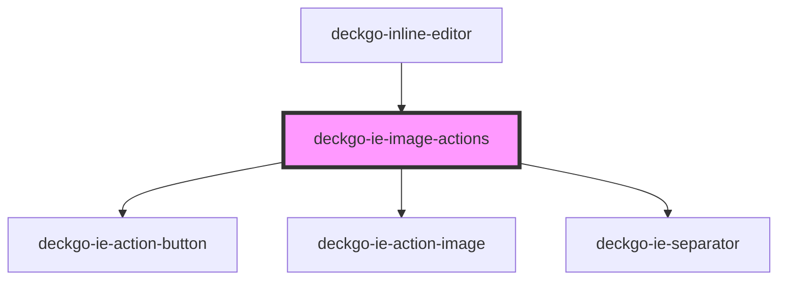

# deckgo-ie-image-actions

<!-- Auto Generated Below -->

## Properties

| Property              | Attribute                | Description | Type                        | Default      |
| --------------------- | ------------------------ | ----------- | --------------------------- | ------------ |
| `anchorEvent`         | --                       |             | `MouseEvent \| TouchEvent`  | `undefined`  |
| `containers`          | `containers`             |             | `string`                    | `undefined`  |
| `imgAnchor`           | `img-anchor`             |             | `string`                    | `undefined`  |
| `imgDidChange`        | --                       |             | `EventEmitter<HTMLElement>` | `undefined`  |
| `imgPropertyCssFloat` | `img-property-css-float` |             | `string`                    | `'cssFloat'` |
| `imgPropertyWidth`    | `img-property-width`     |             | `string`                    | `'width'`    |
| `mobile`              | `mobile`                 |             | `boolean`                   | `undefined`  |

## Events

| Event         | Description | Type                |
| ------------- | ----------- | ------------------- |
| `imgModified` |             | `CustomEvent<void>` |

## Dependencies

### Used by

 - [deckgo-inline-editor](../../inline-editor)

### Depends on

- [deckgo-ie-action-button](../../components/action-button)
- [deckgo-ie-action-image](../../components/action-image)
- [deckgo-ie-separator](../../components/separator)

### Graph

----------------------------------------------

*Built with [StencilJS](https://stenciljs.com/)*
