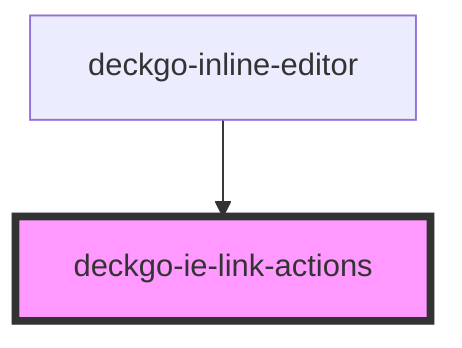

# deckgo-ie-link-actions

<!-- Auto Generated Below -->

## Properties

| Property         | Attribute         | Description | Type                                                                                                                                                                                                                | Default     |
| ---------------- | ----------------- | ----------- | ------------------------------------------------------------------------------------------------------------------------------------------------------------------------------------------------------------------- | ----------- |
| `anchorLink`     | --                |             | `AnchorLink`                                                                                                                                                                                                        | `undefined` |
| `containers`     | `containers`      |             | `string`                                                                                                                                                                                                            | `undefined` |
| `linkCreated`    | --                |             | `EventEmitter<HTMLElement>`                                                                                                                                                                                         | `undefined` |
| `mobile`         | `mobile`          |             | `boolean`                                                                                                                                                                                                           | `undefined` |
| `toolbarActions` | `toolbar-actions` |             | `ToolbarActions.ALIGNMENT \| ToolbarActions.BACKGROUND_COLOR \| ToolbarActions.COLOR \| ToolbarActions.FONT_SIZE \| ToolbarActions.IMAGE \| ToolbarActions.LINK \| ToolbarActions.LIST \| ToolbarActions.SELECTION` | `undefined` |

## Events

| Event          | Description | Type                   |
| -------------- | ----------- | ---------------------- |
| `linkModified` |             | `CustomEvent<boolean>` |

## Dependencies

### Used by

 - [deckgo-inline-editor](../../inline-editor)

### Graph

----------------------------------------------

*Built with [StencilJS](https://stenciljs.com/)*
