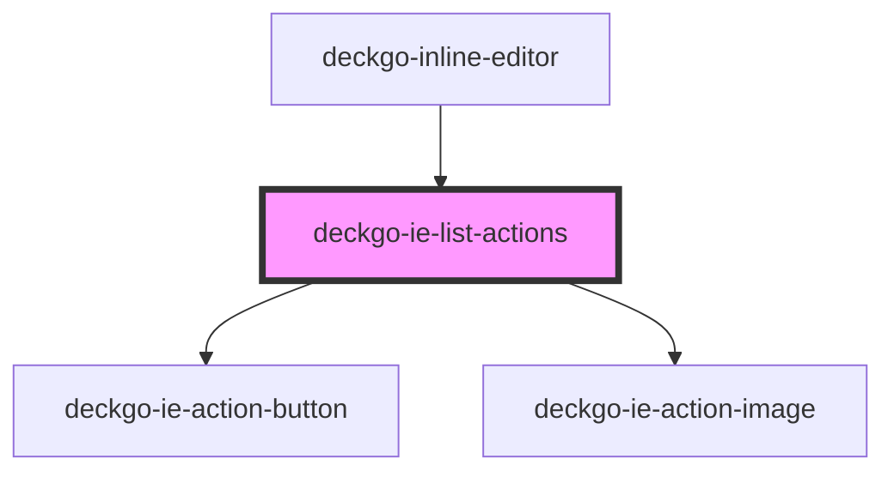

# deckgo-ie-list-actions

<!-- Auto Generated Below -->

## Properties

| Property        | Attribute        | Description | Type                                           | Default     |
| --------------- | ---------------- | ----------- | ---------------------------------------------- | ----------- |
| `contentList`   | `content-list`   |             | `ContentList.ORDERED \| ContentList.UNORDERED` | `undefined` |
| `disabledTitle` | `disabled-title` |             | `boolean`                                      | `false`     |
| `mobile`        | `mobile`         |             | `boolean`                                      | `undefined` |
| `selection`     | --               |             | `Selection`                                    | `undefined` |

## Events

| Event          | Description | Type                |
| -------------- | ----------- | ------------------- |
| `listModified` |             | `CustomEvent<void>` |

## Dependencies

### Used by

- [deckgo-inline-editor](../../inline-editor)

### Depends on

- [deckgo-ie-action-button](../../components/action-button)
- [deckgo-ie-action-image](../../components/action-image)

### Graph

---

_Built with [StencilJS](https://stenciljs.com/)_
