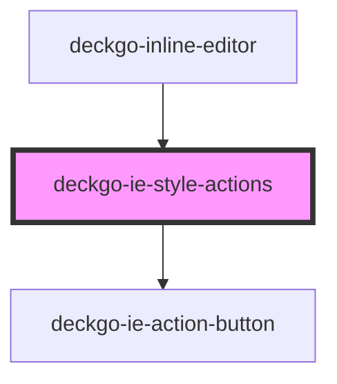

# deckgo-ie-style-actions

<!-- Auto Generated Below -->

## Properties

| Property        | Attribute        | Description | Type        | Default     |
| --------------- | ---------------- | ----------- | ----------- | ----------- |
| `bold`          | `bold`           |             | `boolean`   | `undefined` |
| `disabledTitle` | `disabled-title` |             | `boolean`   | `false`     |
| `italic`        | `italic`         |             | `boolean`   | `undefined` |
| `mobile`        | `mobile`         |             | `boolean`   | `undefined` |
| `selection`     | --               |             | `Selection` | `undefined` |
| `underline`     | `underline`      |             | `boolean`   | `undefined` |

## Events

| Event       | Description | Type               |
| ----------- | ----------- | ------------------ |
| `initStyle` |             | `CustomEvent<any>` |

## Dependencies

### Used by

- [deckgo-inline-editor](../../inline-editor)

### Depends on

- [deckgo-ie-action-button](../../components/action-button)

### Graph

---

_Built with [StencilJS](https://stenciljs.com/)_
