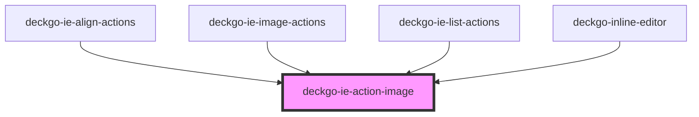

# deckgo-ie-action-image

<!-- Auto Generated Below -->

## Properties

| Property   | Attribute   | Description | Type     | Default     |
| ---------- | ----------- | ----------- | -------- | ----------- |
| `cssClass` | `css-class` |             | `string` | `undefined` |

## Dependencies

### Used by

 - [deckgo-ie-align-actions](../../actions/align-actions)
 - [deckgo-ie-image-actions](../../actions/image-actions)
 - [deckgo-ie-list-actions](../../actions/list-actions)
 - [deckgo-inline-editor](../../inline-editor)

### Graph

----------------------------------------------

*Built with [StencilJS](https://stenciljs.com/)*
