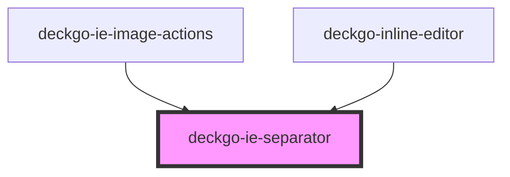

# deckgo-ie-separator

<!-- Auto Generated Below -->

## Properties

| Property | Attribute | Description | Type      | Default     |
| -------- | --------- | ----------- | --------- | ----------- |
| `mobile` | `mobile`  |             | `boolean` | `undefined` |

## Dependencies

### Used by

 - [deckgo-ie-image-actions](../../actions/image-actions)
 - [deckgo-inline-editor](../../inline-editor)

### Graph

----------------------------------------------

*Built with [StencilJS](https://stenciljs.com/)*
