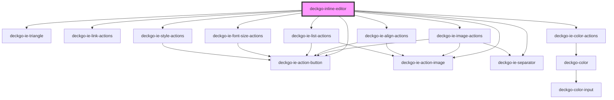

# deckgo-inline-editor

The "WYSIWYG inline editor" component is an HTML floating or sticky rich text editor.

### Video

Have a look at this video where we demonstrate how to use it!

<iframe width="560" height="315" src="https://www.youtube.com/embed/As3bXlnHHFE" frameborder="0"></iframe>

## Installation

This component can be added to your web application with following methods.

### Using from a CDN

It's recommended to use [unpkg](https://unpkg.com/) to use the [DeckDeckGo](https://deckdeckgo.com) inline editor from a CDN. To do so, add the following include script in the main HTML file of your project:

```
<script type="module" src="https://unpkg.com/@deckdeckgo/inline-editor@latest/dist/deckdeckgo-inline-editor/deckdeckgo-inline-editor.esm.js"></script>
```

### Install from NPM

Install it in your project from [npm](https://www.npmjs.com/package/@deckdeckgo/qrcode) using the following command:

```bash
npm install @deckdeckgo/inline-editor
```

### Framework integration

The [Stencil documentation](https://stenciljs.com/docs/overview) provide examples of framework integration for [Angular](https://stenciljs.com/docs/angular), [React](https://stenciljs.com/docs/react), [Vue](https://stenciljs.com/docs/vue) and [Ember](https://stenciljs.com/docs/ember).

That being said, commonly, you might either `import` or `load` it:

#### Import

```
import '@deckdeckgo/inline-editor';
```

#### Loader

```
import { defineCustomElements as deckDeckGoElement } from '@deckdeckgo/inline-editor/dist/loader';
deckDeckGoElement();
```

## Usage

The `<deckgo-inline-editor/>` should be added once only in your page. It will interact with all elements of types `p`, `h1`, `h2` and `h3`, or other `containers` you would define, which are set as `contenteditable`.

<!-- Auto Generated Below -->


## Properties

| Property              | Attribute                | Description                                                                                                                                                                       | Type                  | Default                   |
| --------------------- | ------------------------ | --------------------------------------------------------------------------------------------------------------------------------------------------------------------------------- | --------------------- | ------------------------- |
| `align`               | `align`                  | Actions to manipulat                                                                                                                                                              | `boolean`             | `true`                    |
| `attachTo`            | --                       | Could be use to attach the inline editor event listeners (mousedown, touchstart and keydown) to a specific element instead of the document                                        | `HTMLElement`         | `undefined`               |
| `backgroundColor`     | `background-color`       | To hide the option to select a background-color                                                                                                                                   | `boolean`             | `true`                    |
| `containers`          | `containers`             | A comma separated list of containers where the inline editor should/could be use. Used in order to allow the component to detect some information like the current style or color | `string`              | `'h1,h2,h3,h4,h5,h6,div'` |
| `customActions`       | `custom-actions`         | You might to display and add further actions to the component ? Use this property to provide a comma separated list of actions                                                    | `string`              | `undefined`               |
| `fontSize`            | `font-size`              | Actions to modify the selection font-size enabled?                                                                                                                                | `boolean`             | `true`                    |
| `imgAnchor`           | `img-anchor`             | The type of element to attach the image toolbar                                                                                                                                   | `string`              | `'img'`                   |
| `imgEditable`         | `img-editable`           | Per default, the component will not consider images as editable. Turn this option to true to activate the edition of images                                                       | `boolean`             | `false`                   |
| `imgPropertyCssFloat` | `img-property-css-float` | In case you would like to use a specific property to specify the float on your image                                                                                              | `string`              | `'float'`                 |
| `imgPropertyWidth`    | `img-property-width`     | In case you would like to use a specific property to specify the width on your image                                                                                              | `string`              | `'width'`                 |
| `list`                | `list`                   | Actions to manipulate the selection as list enabled?                                                                                                                              | `boolean`             | `true`                    |
| `mobile`              | `mobile`                 | The mobile mode is automatically recognize, but just it case you would like to "force" it                                                                                         | `boolean`             | `false`                   |
| `palette`             | --                       | In case you would like to define a custom list of colors for the palette of colors. See @deckdeckgo/color for the default list of colors                                          | `DeckdeckgoPalette[]` | `DEFAULT_PALETTE`         |
| `stickyDesktop`       | `sticky-desktop`         | Use a sticky footer toolbar on desktop                                                                                                                                            | `boolean`             | `false`                   |
| `stickyMobile`        | `sticky-mobile`          | Use a sticky footer toolbar on mobile. The sticky bar is positioned bottom except on iOS for which it will be positioned top                                                      | `boolean`             | `false`                   |


## Events

| Event                    | Description                                                                                                               | Type                        |
| ------------------------ | ------------------------------------------------------------------------------------------------------------------------- | --------------------------- |
| `customAction`           | Triggered when a custom action is selected. Its detail provide an action name, the Selection and an anchorLink            | `CustomEvent<InlineAction>` |
| `imgDidChange`           | Triggered when an image is manipulated. Note: the event won't provide directly the image but rather its container element | `CustomEvent<HTMLElement>`  |
| `linkCreated`            | Triggered when a link is created by the user. The event detail is the container                                           | `CustomEvent<HTMLElement>`  |
| `stickyToolbarActivated` |                                                                                                                           | `CustomEvent<boolean>`      |
| `styleDidChange`         | Triggered when the style is modified (bold, italic, color, alignment, etc.). The event detail is the container            | `CustomEvent<HTMLElement>`  |


## Methods

### `reset(clearSelection: boolean, blurActiveElement?: boolean) => Promise<void>`

Reset the inline editor (= hide it) and optionally clear its selection.

#### Returns

Type: `Promise<void>`


## Slots

| Slot | Description                          |
| ---- | ------------------------------------ |
|      | related to the customActions propery |


## CSS Custom Properties

| Name                                                   | Description                                                                                           |
| ------------------------------------------------------ | ----------------------------------------------------------------------------------------------------- |
| `--deckgo-ie-separator-mobile-background`              | The background of the separator on mobile @default #f4f5f8                                            |
| `--deckgo-ie-triangle-start`                           | The left position of the triangle @default 8px                                                        |
| `--deckgo-inline-editor-background-bottom`             | The bottom background of the toolbar (linear gradient) @default white                                 |
| `--deckgo-inline-editor-background-top`                | The top background of the toolbar (linear gradient) @default white                                    |
| `--deckgo-inline-editor-border`                        | The border radius of the toolbar                                                                      |
| `--deckgo-inline-editor-border-radius`                 | The border radius of the toolbar @default 8px                                                         |
| `--deckgo-inline-editor-box-shadow`                    | A box shadow for the toolbar @default 0 0 8px 4px rgba(0, 0, 0, 0.1)                                  |
| `--deckgo-inline-editor-button-color`                  | The buttons color @default black                                                                      |
| `--deckgo-inline-editor-button-color-active`           | The color of the buttons when active @default #3880ff                                                 |
| `--deckgo-inline-editor-button-color-disabled`         | The color of the buttons when disabled @default #f4f5f8                                               |
| `--deckgo-inline-editor-button-display-disabled`       | Per default the disable elements on title elements are not displayed @default none                    |
| `--deckgo-inline-editor-button-font-family`            | The buttons font family @default inherit                                                              |
| `--deckgo-inline-editor-button-font-size`              | The buttons font size @default 1.4rem                                                                 |
| `--deckgo-inline-editor-button-mobile-color-active`    | The buttons color on mobile if active @default #3880ff                                                |
| `--deckgo-inline-editor-button-mobile-color-disabled`  | The color of the buttons when disabled on mobile @default #f4f5f8                                     |
| `--deckgo-inline-editor-button-zindex`                 | The z-index of the action buttons @default 2                                                          |
| `--deckgo-inline-editor-link-color`                    | The color property of the link input @default black                                                   |
| `--deckgo-inline-editor-link-mobile-color`             | The color property of the link input on mobile @default inherit                                       |
| `--deckgo-inline-editor-link-mobile-placeholder-color` | : The color of the place holder of the link input on mobile @default inherit                          |
| `--deckgo-inline-editor-link-placeholder-color`        | The color of the place holder of the link input @default black                                        |
| `--deckgo-inline-editor-link-zindex`                   | The z-index property of the link input @default 2                                                     |
| `--deckgo-inline-editor-mobile-background-bottom`      | A bottom background for the toolbar (linear gradient) @default #fff                                   |
| `--deckgo-inline-editor-mobile-background-top`         | A top background for the toolbar (linear gradient) @default #fff                                      |
| `--deckgo-inline-editor-mobile-border`                 | Border of the toolbar @default 0                                                                      |
| `--deckgo-inline-editor-mobile-box-shadow`             | A box shadow for the toolbar @default 0 0 8px 4px rgba(0, 0, 0, 0.1)                                  |
| `--deckgo-inline-editor-padding`                       | The padding of the toolbar @default 0 8px                                                             |
| `--deckgo-inline-editor-position`                      | The position of the toolbar @default absolute                                                         |
| `--deckgo-inline-editor-separator-background`          | The background of the separator @default #f4f5f8                                                      |
| `--deckgo-inline-editor-sticky-bottom`                 | The bottom attribute of the sticky toolbar @default 0                                                 |
| `--deckgo-inline-editor-sticky-height`                 | The height of the sticky toolbar @default 56px                                                        |
| `--deckgo-inline-editor-sticky-scroll`                 | Top position if sticky @default 0                                                                     |
| `--deckgo-inline-editor-sticky-zindex`                 | The z-Index of the sticky toolbar                                                                     |
| `--deckgo-inline-editor-transform`                     | The transform property of the toolbar, useful for example if your viewport contains a split menu pane |
| `--deckgo-inline-editor-triangle-box-shadow`           | The box-shadow of the triangle @default 0 0 8px 0 rgba(0, 0, 0, 0.1)                                  |
| `--deckgo-inline-editor-width`                         | The width of the toolbar @default inherit                                                             |
| `--deckgo-inline-editor-zindex`                        | The z-Index of the toolbar @default 1                                                                 |


## Dependencies

### Depends on

- [deckgo-ie-triangle](../components/triangle)
- [deckgo-ie-link-actions](../actions/link-actions)
- [deckgo-ie-color-actions](../actions/color-actions)
- [deckgo-ie-image-actions](../actions/image-actions)
- [deckgo-ie-align-actions](../actions/align-actions)
- [deckgo-ie-list-actions](../actions/list-actions)
- [deckgo-ie-font-size-actions](../actions/font-size-actions)
- [deckgo-ie-style-actions](../actions/style-actions)
- [deckgo-ie-action-button](../components/action-button)
- [deckgo-ie-action-image](../components/action-image)
- [deckgo-ie-separator](../components/separator)

### Graph


----------------------------------------------

*Built with [StencilJS](https://stenciljs.com/)*
