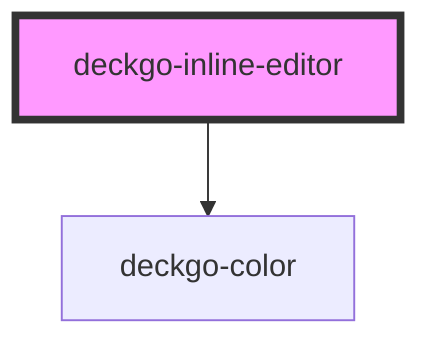

# deckgo-inline-editor

<!-- Auto Generated Below -->

## Properties

| Property              | Attribute                | Description | Type          | Default                   |
| --------------------- | ------------------------ | ----------- | ------------- | ------------------------- |
| `attachTo`            | --                       |             | `HTMLElement` | `undefined`               |
| `containers`          | `containers`             |             | `string`      | `'h1,h2,h3,h4,h5,h6,div'` |
| `imgAnchor`           | `img-anchor`             |             | `string`      | `'img'`                   |
| `imgEditable`         | `img-editable`           |             | `boolean`     | `false`                   |
| `imgPropertyCssFloat` | `img-property-css-float` |             | `string`      | `'cssFloat'`              |
| `imgPropertyWidth`    | `img-property-width`     |             | `string`      | `'width'`                 |
| `list`                | `list`                   |             | `boolean`     | `true`                    |
| `mobile`              | `mobile`                 |             | `boolean`     | `false`                   |
| `stickyDesktop`       | `sticky-desktop`         |             | `boolean`     | `false`                   |
| `stickyMobile`        | `sticky-mobile`          |             | `boolean`     | `false`                   |

## Events

| Event                    | Description | Type                       |
| ------------------------ | ----------- | -------------------------- |
| `imgDidChange`           |             | `CustomEvent<HTMLElement>` |
| `linkCreated`            |             | `CustomEvent<HTMLElement>` |
| `stickyToolbarActivated` |             | `CustomEvent<boolean>`     |

## Methods

### `reset(clearSelection: boolean, blurActiveElement?: boolean) => Promise<void>`

#### Returns

Type: `Promise<void>`

## Dependencies

### Depends on

- deckgo-color

### Graph

----------------------------------------------

*Built with [StencilJS](https://stenciljs.com/)*
