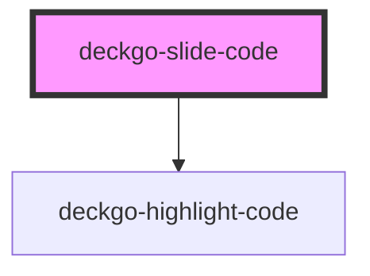

# deckgo-slide-code

The "Code" slide can be used if you would like to showcase code during your talk.

## Installation

This template could be added to your presentation using the following methods.

> This template is included per default in our Developer Kit

### From a CDN

It's recommended to use [unpkg](https://unpkg.com/) if you want to use this template from a CDN. To do so, add the following include script in the main HTML file of your project:

```
<script type="module" src="https://unpkg.com/@deckdeckgo/slide-code@latest/dist/deckdeckgo-slide-code/deckdeckgo-slide-code.esm.js"></script>
```

### From NPM

To install this template in your project from [npm](https://www.npmjs.com/package/@deckdeckgo/slide-code) run the following command:

```bash
npm install @deckdeckgo/slide-code
```

### Framework integration

The [Stencil documentation](https://stenciljs.com/docs/overview) provide examples of framework integration for [Angular](https://stenciljs.com/docs/angular), [React](https://stenciljs.com/docs/react), [Vue](https://stenciljs.com/docs/vue) and [Ember](https://stenciljs.com/docs/ember).

That being said, commonly, you might either `import` or `load` it:

#### Import

```
import '@deckdeckgo/slide-code';
```

#### Loader

```
import { defineCustomElements as deckDeckGoSlideElement } from '@deckdeckgo/slide-code/dist/loader';
deckDeckGoSlideElement();
```

## Usage

The "Code" slide's Web Component could be integrated using the tag `<deckgo-slide-code/>`.

You could provide a file URI to the code you want to display or provide it with a slotted element.

### Usage with file URI

```
<deckgo-deck>
  <deckgo-slide-code src="https://domain.com/path-to-my-code.extension">
    <h1 slot="title">My code</h1>
  </deckgo-slide-code>
</deckgo-deck>
```

### Usage with slotted element

```
<deckgo-deck>
  <deckgo-slide-code language="java">
      <h1 slot="title">Manual code</h1>
      <code slot="code">
  interface DeckDeckGoDemo {
    boolean helloWorld();
  }
  </deckgo-slide-code>
</deckgo-deck>
```

### Highlight Code component

This template relies on the `@deckdeckgo/highlight-code` component without any explicit dependency. Therefore it should also be installed.


<!-- Auto Generated Below -->


## Properties

| Property           | Attribute           | Description                                                                                                        | Type                                                                                                                       | Default                                      |
| ------------------ | ------------------- | ------------------------------------------------------------------------------------------------------------------ | -------------------------------------------------------------------------------------------------------------------------- | -------------------------------------------- |
| `anchor`           | `anchor`            | The anchor identifier which will be use to find the next anchor to scroll too using findNextAnchor()               | `string`                                                                                                                   | `'// DeckDeckGo'`                            |
| `anchorZoom`       | `anchor-zoom`       | The anchor identifier which will be use to find the next anchor to zoom inside your code using findNextAnchor()    | `string`                                                                                                                   | `'// DeckDeckGoZoom'`                        |
| `customActions`    | `custom-actions`    | If you provide actions for the all deck but, a specific one for this slide, set this option to true                | `boolean`                                                                                                                  | `false`                                      |
| `customBackground` | `custom-background` | If you define a background for the all deck but, a specific one for this slide, set this option to true            | `boolean`                                                                                                                  | `false`                                      |
| `hideAnchor`       | `hide-anchor`       | Set this attribute to false in case you would like to actually display the anchor value too                        | `boolean`                                                                                                                  | `true`                                       |
| `language`         | `language`          | Define the language to be used for the syntax highlighting. The list of supported languages is defined by Prism.js | `string`                                                                                                                   | `'javascript'`                               |
| `src`              | `src`               | The web url to the source code you would like to showcase                                                          | `string`                                                                                                                   | `undefined`                                  |
| `terminal`         | `terminal`          | Present the code in a stylish "windowed" card                                                                      | `DeckdeckgoHighlightCodeTerminal.CARBON \| DeckdeckgoHighlightCodeTerminal.NONE \| DeckdeckgoHighlightCodeTerminal.UBUNTU` | `DeckdeckgoHighlightCodeTerminal.CARBON`     |
| `theme`            | `theme`             | The theme of the selected terminal (applied only in case of carbon)                                                | `DeckdeckgoHighlightCodeCarbonTheme`                                                                                       | `DeckdeckgoHighlightCodeCarbonTheme.DRACULA` |


## Events

| Event          | Description                                  | Type                   |
| -------------- | -------------------------------------------- | ---------------------- |
| `scrolling`    | An event triggered when the code is scrolled | `CustomEvent<boolean>` |
| `slideDidLoad` | Triggered when the slide is loaded           | `CustomEvent<void>`    |


## Methods

### `afterSwipe() => Promise<void>`


#### Returns

Type: `Promise<void>`


### `beforeSwipe(_enter: boolean, _reveal: boolean) => Promise<boolean>`


#### Returns

Type: `Promise<boolean>`


### `hideContent() => Promise<void>`


#### Returns

Type: `Promise<void>`


### `lazyLoadContent() => Promise<void>`


#### Returns

Type: `Promise<void>`


### `revealContent() => Promise<void>`


#### Returns

Type: `Promise<void>`


## Slots

| Slot           | Description                                     |
| -------------- | ----------------------------------------------- |
| `"actions"`    | Custom actions for this slide                   |
| `"background"` | A custom background for this slide              |
| `"code"`       | A block of code to highlight if src is not used |
| `"footer"`     | A custom footer for this slide                  |
| `"header"`     | A custom header for this slide                  |
| `"notes"`      | Some notes related to this slide                |
| `"title"`      | A title                                         |


## CSS Custom Properties

| Name                     | Description                                                        |
| ------------------------ | ------------------------------------------------------------------ |
| `--background`           | background                                                         |
| `--code-user-select`     | code user select @default text                                     |
| `--color`                | color                                                              |
| `--overflow`             | overflow of the slide @default hidden                              |
| `--slide-padding-bottom` | Padding bottom of the slide @default 64px and 32px on wider screen |
| `--slide-padding-end`    | Padding right of the slide @default 64px and 32px on wider screen  |
| `--slide-padding-start`  | Padding left of the slide @default 64px and 32px on wider screen   |
| `--slide-padding-top`    | Padding top of the slide @default 64px and 32px on wider screen    |
| `--slide-user-select`    | user select @default none                                          |
| `--zIndex`               | z-index @default 1                                                 |


## Dependencies

### Depends on

- deckgo-highlight-code

### Graph


----------------------------------------------

*Built with [StencilJS](https://stenciljs.com/)*
