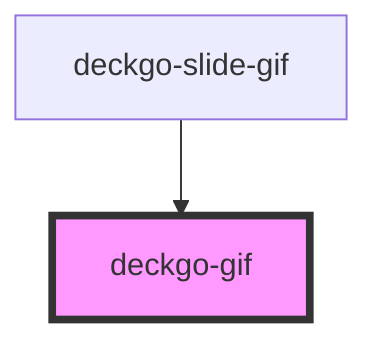

# deckgo-gif

<!-- Auto Generated Below -->

## Properties

| Property     | Attribute    | Description | Type      | Default     |
| ------------ | ------------ | ----------- | --------- | ----------- |
| `alt`        | `alt`        |             | `string`  | `undefined` |
| `fullscreen` | `fullscreen` |             | `boolean` | `false`     |
| `src`        | `src`        |             | `string`  | `undefined` |

## Events

| Event       | Description | Type                   |
| ----------- | ----------- | ---------------------- |
| `gifLoaded` |             | `CustomEvent<boolean>` |

## Methods

### `lazyLoadContent() => Promise<void>`

#### Returns

Type: `Promise<void>`

## Dependencies

### Used by

 - [deckgo-slide-gif](../slide)

### Graph

----------------------------------------------

*Built with [StencilJS](https://stenciljs.com/)*
