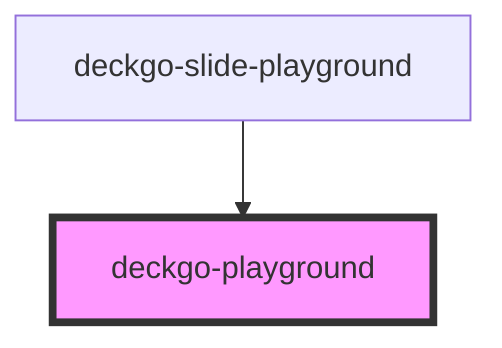

# deckgo-playground

<!-- Auto Generated Below -->

## Properties

| Property          | Attribute          | Description | Type                                                                                                     | Default                             |
| ----------------- | ------------------ | ----------- | -------------------------------------------------------------------------------------------------------- | ----------------------------------- |
| `allowFullscreen` | `allow-fullscreen` |             | `boolean`                                                                                                | `true`                              |
| `frameTitle`      | `frame-title`      |             | `string`                                                                                                 | `undefined`                         |
| `height`          | `height`           |             | `number`                                                                                                 | `undefined`                         |
| `instant`         | `instant`          |             | `boolean`                                                                                                | `false`                             |
| `src`             | `src`              |             | `string`                                                                                                 | `undefined`                         |
| `theme`           | `theme`            |             | `DeckdeckgoPlaygroundTheme.DARK \| DeckdeckgoPlaygroundTheme.DEFAULT \| DeckdeckgoPlaygroundTheme.LIGHT` | `DeckdeckgoPlaygroundTheme.DEFAULT` |
| `width`           | `width`            |             | `number`                                                                                                 | `undefined`                         |

## Methods

### `lazyLoadContent() => Promise<void>`

#### Returns

Type: `Promise<void>`

## Dependencies

### Used by

 - [deckgo-slide-playground](../slide)

### Graph

----------------------------------------------

*Built with [StencilJS](https://stenciljs.com/)*
