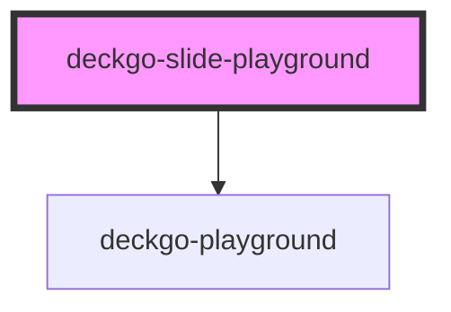

# deckgo-slide-playground

The "Playground" template helps embed easily playgrounds as [Codepen](https://codepen.io), [JSFiddle](https://jsfiddle.net/) and [WebComponents.dev](https://webcomponents.dev) in your presentation.

## Installation

This template could be added to your presentation using the following methods.

> If you are using our Starter Kit, no need to worry about this, this template is included, therefore you could skip the "Installation" chapter.

### From a CDN

It's recommended to use [unpkg](https://unpkg.com/) if you want to use this template from a CDN. To do so, add the following include script in the main HTML file of your project:

```
<script type="module" src="https://unpkg.com/@deckdeckgo/slide-playground@latest/dist/deckdeckgo-slide-playground/deckdeckgo-slide-playground.esm.js"></script>
```

### From NPM

To install this template in your project from [npm](https://www.npmjs.com/package/@deckdeckgo/slide-playground) run the following command:

```bash
npm install @deckdeckgo/slide-playground
```

### Framework integration

The [Stencil documentation](https://stenciljs.com/docs/overview) provide examples of framework integration for [Angular](https://stenciljs.com/docs/angular), [React](https://stenciljs.com/docs/react), [Vue](https://stenciljs.com/docs/vue) and [Ember](https://stenciljs.com/docs/ember).

That being said, commonly, you might either `import` or `load` it:

#### Import

```
import '@deckdeckgo/slide-playground';
```

#### Loader

```
import { defineCustomElements as deckDeckGoSlideElement } from '@deckdeckgo/slide-playground/dist/loader';
deckDeckGoSlideElement();
```

## Usage

The "Playground" slide's Web Component could be integrated using the tag `<deckgo-slide-playground/>`.

```
<deckgo-slide-playground src="https://codepen.io/peterpeterparker/pen/dyGbOZm">
  <h1 slot="title">My Codepen</h1>
</deckgo-slide-playground>
```

<!-- Auto Generated Below -->


## Properties

| Property           | Attribute           | Description                                                                                                                                               | Type                                                                                                     | Default                             |
| ------------------ | ------------------- | --------------------------------------------------------------------------------------------------------------------------------------------------------- | -------------------------------------------------------------------------------------------------------- | ----------------------------------- |
| `allowFullscreen`  | `allow-fullscreen`  | Allow toggle to fullscreen                                                                                                                                | `boolean`                                                                                                | `true`                              |
| `customActions`    | `custom-actions`    | If you provide actions for the all deck but, a specific one for this slide, set this option to true                                                       | `boolean`                                                                                                | `false`                             |
| `customBackground` | `custom-background` | If you define a background for the all deck but, a specific one for this slide, set this option to true                                                   | `boolean`                                                                                                | `false`                             |
| `height`           | `height`            | Per default the playground height will be calculated according the content size available. Using this option you would be able to define your own height. | `number`                                                                                                 | `undefined`                         |
| `src`              | `src`               | The full link to your Pen, Fiddle oder WebComponents.dev. The component will take care of converting the link to an embeddable one                        | `string`                                                                                                 | `undefined`                         |
| `theme`            | `theme`             | The theming option if it can be applied respectivelly if supported by the third party playground, otherwise, 'default'                                    | `DeckdeckgoPlaygroundTheme.DARK \| DeckdeckgoPlaygroundTheme.DEFAULT \| DeckdeckgoPlaygroundTheme.LIGHT` | `DeckdeckgoPlaygroundTheme.DEFAULT` |
| `width`            | `width`             | Per default the playground width will be calculated according the content size available. Using this option you would be able to define your own width.   | `number`                                                                                                 | `undefined`                         |


## Events

| Event          | Description                        | Type                |
| -------------- | ---------------------------------- | ------------------- |
| `slideDidLoad` | Triggered when the slide is loaded | `CustomEvent<void>` |


## Methods

### `afterSwipe() => Promise<void>`


#### Returns

Type: `Promise<void>`


### `beforeSwipe(_enter: boolean, _reveal: boolean) => Promise<boolean>`


#### Returns

Type: `Promise<boolean>`


### `hideContent() => Promise<void>`


#### Returns

Type: `Promise<void>`


### `lazyLoadContent() => Promise<void>`


#### Returns

Type: `Promise<void>`


### `resizeContent() => Promise<void>`


#### Returns

Type: `Promise<void>`


### `revealContent() => Promise<void>`


#### Returns

Type: `Promise<void>`


## Slots

| Slot           | Description                        |
| -------------- | ---------------------------------- |
| `"actions"`    | Custom actions for this slide      |
| `"background"` | A custom background for this slide |
| `"content"`    | Some more optional content         |
| `"footer"`     | A custom footer for this slide     |
| `"header"`     | A custom header for this slide     |
| `"notes"`      | Some notes related to this slide   |
| `"title"`      | A title                            |


## CSS Custom Properties

| Name                          | Description                                                         |
| ----------------------------- | ------------------------------------------------------------------- |
| `--background`                | background                                                          |
| `--color`                     | color                                                               |
| `--overflow`                  | overflow of the slide @default hidden                               |
| `--slide-padding-bottom`      | Padding bottom of the slide @default 64px and 32px on wider screen  |
| `--slide-padding-end`         | Padding right of the slide @default 64px and 32px on wider screen   |
| `--slide-padding-start`       | Padding left of the slide @default 64px and 32px on wider screen    |
| `--slide-padding-top`         | Padding top of the slide @default 64px and 32px on wider screen     |
| `--slide-playground-height`   | The height of the playground's container @default calc(100% - 32px) |
| `--slide-playground-margin`   | The margin of the playground's container @default 32px 0 32px       |
| `--slide-playground-overflow` | The overflow of the playground's container @default auto            |
| `--slide-user-select`         | user select @default none                                           |
| `--zIndex`                    | z-index @default 1                                                  |


## Dependencies

### Depends on

- [deckgo-playground](../playground)

### Graph


----------------------------------------------

*Built with [StencilJS](https://stenciljs.com/)*
