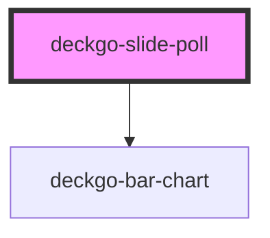

# deckgo-slide-qrcode

<!-- Auto Generated Below -->

## Properties

| Property            | Attribute             | Description | Type      | Default     |
| ------------------- | --------------------- | ----------- | --------- | ----------- |
| `connectPollServer` | `connect-poll-server` |             | `boolean` | `true`      |
| `customActions`     | `custom-actions`      |             | `boolean` | `false`     |
| `customBackground`  | `custom-background`   |             | `boolean` | `false`     |
| `imgAlt`            | `img-alt`             |             | `string`  | `undefined` |
| `imgSrc`            | `img-src`             |             | `string`  | `undefined` |
| `pollLink`          | `poll-link`           |             | `string`  | `undefined` |
| `pollServer`        | `poll-server`         |             | `string`  | `undefined` |

## Events

| Event          | Description | Type                |
| -------------- | ----------- | ------------------- |
| `slideDidLoad` |             | `CustomEvent<void>` |

## Methods

### `afterSwipe() => Promise<void>`

#### Returns

Type: `Promise<void>`

### `beforeSwipe(_enter: boolean, _reveal: boolean) => Promise<boolean>`

#### Returns

Type: `Promise<boolean>`

### `hideContent() => Promise<void>`

#### Returns

Type: `Promise<void>`

### `lazyLoadContent() => Promise<void>`

#### Returns

Type: `Promise<void>`

### `resizeContent() => Promise<void>`

#### Returns

Type: `Promise<void>`

### `revealContent() => Promise<void>`

#### Returns

Type: `Promise<void>`

## Dependencies

### Depends on

- deckgo-bar-chart

### Graph

----------------------------------------------

*Built with [StencilJS](https://stenciljs.com/)*
