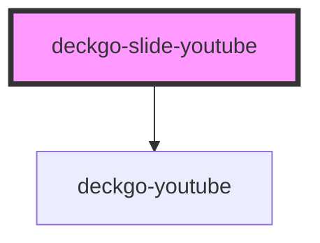

# deckgo-slide-youtube

<!-- Auto Generated Below -->

## Properties

| Property           | Attribute           | Description | Type      | Default     |
| ------------------ | ------------------- | ----------- | --------- | ----------- |
| `allowFullscreen`  | `allow-fullscreen`  |             | `boolean` | `true`      |
| `customActions`    | `custom-actions`    |             | `boolean` | `false`     |
| `customBackground` | `custom-background` |             | `boolean` | `false`     |
| `height`           | `height`            |             | `number`  | `undefined` |
| `src`              | `src`               |             | `string`  | `undefined` |
| `width`            | `width`             |             | `number`  | `undefined` |

## Events

| Event          | Description | Type                |
| -------------- | ----------- | ------------------- |
| `slideDidLoad` |             | `CustomEvent<void>` |

## Methods

### `afterSwipe() => Promise<void>`

#### Returns

Type: `Promise<void>`

### `beforeSwipe(_enter: boolean, _reveal: boolean) => Promise<boolean>`

#### Returns

Type: `Promise<boolean>`

### `hideContent() => Promise<void>`

#### Returns

Type: `Promise<void>`

### `lazyLoadContent() => Promise<void>`

#### Returns

Type: `Promise<void>`

### `pause() => Promise<void>`

#### Returns

Type: `Promise<void>`

### `play() => Promise<void>`

#### Returns

Type: `Promise<void>`

### `resizeContent() => Promise<void>`

#### Returns

Type: `Promise<void>`

### `revealContent() => Promise<void>`

#### Returns

Type: `Promise<void>`

### `toggle() => Promise<void>`

#### Returns

Type: `Promise<void>`

## Dependencies

### Depends on

- [deckgo-youtube](../youtube)

### Graph

----------------------------------------------

*Built with [StencilJS](https://stenciljs.com/)*
